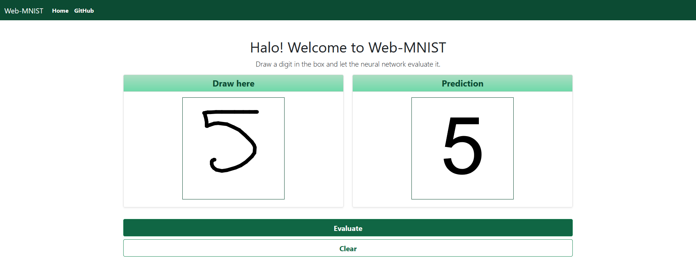

# Web-MNIST
A digit recognizer web app made using django and tensorflow.keras. 
[Here](https://github.com/lorenzophys/web-MNIST) a version of the same app using flask.



### Architecture used

The model for prediction was built with tensorflow.keras.
The neural network was trained on the [MNIST database of handwritten digits](http://yann.lecun.com/exdb/mnist/)
with the following architecture:
```
model = keras.Sequential(
    [
        keras.layers.Conv2D(filters=32, kernel_size=5, padding="same", activation="relu", input_shape=(28, 28, 1)),
        keras.layers.BatchNormalization(),
        keras.layers.Conv2D(filters=32, kernel_size=5, strides=2, padding="same", activation="relu"),
        keras.layers.BatchNormalization(),
        
        keras.layers.Conv2D(filters=64, kernel_size=5, padding="same", activation="relu"),
        keras.layers.BatchNormalization(),
        keras.layers.Conv2D(filters=64, kernel_size=5, strides=2, padding="same", activation="relu"),
        keras.layers.BatchNormalization(),
        
        keras.layers.Flatten(),
        keras.layers.Dense(256, activation='relu'),
        keras.layers.Dense(10, activation='softmax'),
    ]
)
```
The model was compiled with these parameters:

```
model.compile(optimizer="adam", loss="sparse_categorical_crossentropy", metrics=["accuracy"])
```
and data augmentation was used:

```
datagen = ImageDataGenerator(rotation_range=10,
                             width_shift_range=0.1,
                             shear_range=0.2,
                             height_shift_range=0.1,
                             zoom_range=0.1,
                             horizontal_flip=False,
                             vertical_flip=False)
```

The full notebook where the model was tested can be found [here](https://github.com/lorenzophys/deep-learning-playground/blob/main/MNIST_handwritten_digits/MNIST_digit_CNN_data_augmentation.ipynb).
### Built with

* [Django](https://www.djangoproject.com/)  
* [Bootstrap](https://getbootstrap.com/)   
* [jQuery](https://jquery.com/)  
* [Tensorflow](https://www.tensorflow.org/)

## Usage

1. Clone the repo
```console
$ git clone https://github.com/lorenzophys/django-web-MNIST.git
```

2. Install the packages
```console
$ cd django-web-MNIST
$ pipenv install
```

3. Open the virtual environment shell
```console
$ pipenv shell
```

4. Run the app
```console
$ python manage.py runserver
```

## License
This project is licensed under the **MIT License** - see the LICENSE.md file for details
